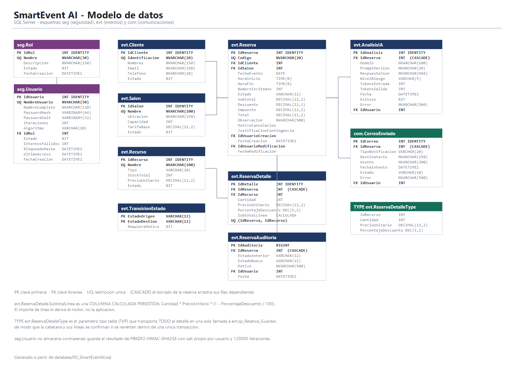
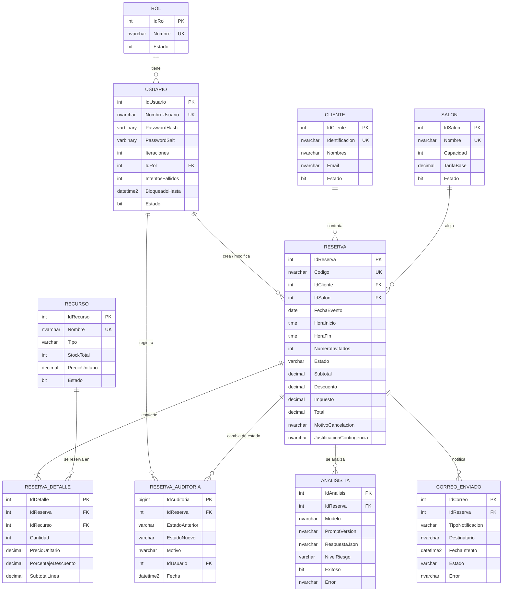

# Modelo de datos



> La imagen se genera con [`generar-modelo-datos.ps1`](generar-modelo-datos.ps1) y es fiel a
> [`database/00_SmartEventAI.sql`](../database/00_SmartEventAI.sql), que es la fuente de verdad.

---

## Diagrama entidad-relación



---

## Esquemas

| Esquema | Contenido | Por qué está separado |
|---|---|---|
| `seg` | `Rol`, `Usuario` | Seguridad aislada del negocio: permite dar permisos distintos sobre estas tablas. |
| `evt` | Catálogos, reservas, detalle, auditoría y análisis de IA | Núcleo del negocio. |
| `com` | `CorreoEnviado` | Comunicaciones salientes; se puede purgar o archivar sin tocar el negocio. |

---

## Decisiones de modelado

### 1. `SubtotalLinea` es una columna calculada **persistida**

```sql
SubtotalLinea AS CAST(Cantidad * PrecioUnitario * (1 - PorcentajeDescuento / 100.0)
                 AS DECIMAL(12,2)) PERSISTED
```

El importe de línea **no lo escribe la aplicación**: lo deriva el motor. Aunque alguien
manipulara el cliente o llamara al procedimiento por otra vía, el subtotal siempre corresponde
a cantidad, precio y descuento reales.

### 2. Contraseñas: `VARBINARY` con salt e iteraciones por usuario

`seg.Usuario` no guarda contraseñas ni un hash simple. Guarda el resultado de
**PBKDF2-HMAC-SHA256** con un salt de 16 bytes propio de cada usuario y 120 000 iteraciones,
junto con los parámetros necesarios para reproducir la derivación.

Dos usuarios con la misma contraseña producen hashes distintos, y probar contraseñas por fuerza
bruta resulta costoso. El hash **nunca sale de la base**: la comparación ocurre dentro de
`seg.sp_Usuario_Autenticar`.

### 3. El bloqueo por intentos fallidos está **en la tabla**

`IntentosFallidos` y `BloqueadoHasta` son columnas, no variables en memoria de la aplicación.
Cerrar y reabrir el programa no evita el bloqueo.

### 4. Las transiciones de estado son **datos**, no código

`evt.TransicionEstado` contiene las cuatro transiciones legales:

| Origen | Destino | Requiere motivo |
|---|---|---|
| BORRADOR | CONFIRMADA | No |
| BORRADOR | CANCELADA | Sí |
| CONFIRMADA | FINALIZADA | No |
| CONFIRMADA | CANCELADA | Sí |

Cualquier otra combinación se rechaza porque **no existe la fila**. `FINALIZADA` y `CANCELADA`
no aparecen como origen: son terminales por construcción.

### 5. El TVP `evt.ReservaDetalleType`

No es una tabla: es un **tipo tabla** que transporta todo el detalle en una sola llamada a
`evt.sp_Reserva_Guardar`. Es el mecanismo que hace posible que cabecera y líneas se confirmen o
se reviertan juntas, en lugar de enviar un `INSERT` por fila desde el formulario.

### 6. Borrado en cascada solo hacia dependientes de la reserva

`ReservaDetalle`, `ReservaAuditoria`, `AnalisisIA` y `CorreoEnviado` se eliminan con su reserva
(`ON DELETE CASCADE`): sin reserva no tienen sentido.

Los catálogos **nunca** se borran en cascada, y de hecho no se borran nunca: la baja es lógica
(`Estado = 0`), porque las reservas históricas siguen apuntando a ellos.

---

## Restricciones que hacen cumplir las reglas de negocio

| Restricción | Regla que garantiza |
|---|---|
| `CK_Reserva_Horas` | `HoraFin > HoraInicio` |
| `CK_Reserva_Duracion` | Duración entre 2 y 12 horas |
| `CK_Reserva_Invitados` | Invitados > 0 |
| `CK_Reserva_TotalOk` | `Total = (Subtotal − Descuento) + Impuesto` |
| `CK_Reserva_DescMax` | El descuento global no supera el subtotal |
| `CK_Reserva_Cancel` | Una reserva CANCELADA tiene motivo de ≥ 20 caracteres |
| `CK_Detalle_Descuento` | Descuento de línea entre 0 y 20 % |
| `CK_Detalle_Cantidad` | Cantidad > 0 |
| `UQ_Detalle_Reserva_Rec` | Un recurso no se repite en la misma reserva |
| `CK_Cliente_Email` | El correo tiene estructura válida |
| `CK_AnalisisIA_Json` | `RespuestaJson` es JSON válido (`ISJSON`) |
| `CK_AnalisisIA_Coher` | Un análisis exitoso tiene JSON y nivel; uno fallido tiene error |
| `CK_Correo_Error` | Un correo con estado ERROR tiene siempre el motivo |

Las reglas que dependen del **estado global** de la base —cruce de franja horaria y stock
concurrente— no pueden expresarse como `CHECK` y viven en `evt.sp_Disponibilidad_Validar`, que
se invoca **dentro** de la transacción de guardado.

---

## Índices

| Índice | Consulta que acelera |
|---|---|
| `IX_Reserva_Salon_Fecha` | Detección de cruce de franja por salón y fecha |
| `IX_Reserva_Fecha_Estado` | Cálculo de stock concurrente |
| `IX_Reserva_Cliente` | Consulta histórica filtrada por cliente |
| `IX_Detalle_Recurso` | Comprobación de recursos comprometidos |
| `IX_AnalisisIA_Reserva`, `IX_Correo_Reserva`, `IX_ResAud_Reserva` | Pantallas de auditoría |
